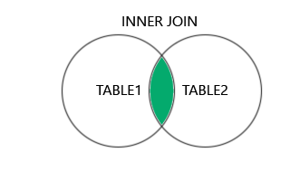
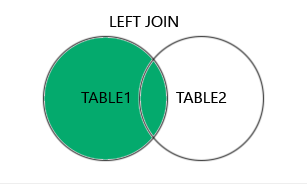
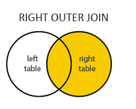
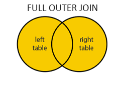

Join Operator
Join operators are relational operators that combine data from multiple tables into a single result table.
The source tables may have little to nothing in common with each other.
A JOIN clause is used to combine rows from two or more tables based on a related column between them

## Inner Join
Returns only matching joins from each joined table
Used when their is at least one match in both tables
Tables are joined based on one table having a foreign key to another tables primary key

```shell
SELECT column_name(s)
FROM table1
INNER JOIN table2
ON table1.column_name = table2.column_name;


SELECT employee.FName, employee.EmpID, customer.FName, customer.CustomerID
FROM employee
INNER JOIN customer
ON employee.LName = customer.LName
;
+-------+-------+--------+------------+
| FName | EmpID | FName  | CustomerID |
+-------+-------+--------+------------+
| Don   |     2 | Mike   |          1 |
| Bob   |     4 | Rachel |          4 |
| Don   |     2 | Don    |          5 |
+-------+-------+--------+------------+
```
```shell
SELECT column(s)
FROM table1
INNER JOIN table2
ON table1.column = table2.column
WHERE conditions
ORDER BY column(s);

SELECT employee.FName, employee.EmpID, customer.FName, customer.CustomerID
FROM employee
INNER JOIN customer
ON employee.LName = customer.LName
WHERE employee.EmpID = 4 AND customer.CustomerID = 4
;
+-------+-------+--------+------------+
| FName | EmpID | FName  | CustomerID |
+-------+-------+--------+------------+
| Bob   |     4 | Rachel |          4 |
+-------+-------+--------+------------+
```


Outer Join


Left Outer Join   (Also referred to as LEFT JOIN)
Returns all rows from the left table and any matching rows between the left and right table
Where there are values from the left table but no matching values from the right table, NULL is returned for those cells.


```shell
SELECT employee.FName, employee.EmpID, customer.FName, customer.CustomerID
FROM employee
LEFT OUTER JOIN customer
ON employee.EmpID = customer.CustomerID
;

+---------+-------+--------+------------+
| FName   | EmpID | FName  | CustomerID |
+---------+-------+--------+------------+
| Whitley |     1 | Mike   |          1 |
| Don     |     2 | Bob    |          2 |
| Sal     |     3 | Sophia |          3 |
| Bob     |     4 | Rachel |          4 |
+---------+-------+--------+------------+

```
Right Outer Join
Returns all rows from the right table and any matching rows between the right and left table. 
Where there are no matching values from the left table, the cells are NULL

```shell
SELECT employee.*, customer.*
FROM employee
RIGHT OUTER JOIN customer
ON employee.LName = customer.LName
;
+-------+-------+--------+---------+----------+------------+--------+--------+--------+
| EmpID | FName | LName  | City    | Phone    | CustomerID | FName  | LName  | Rating |
+-------+-------+--------+---------+----------+------------+--------+--------+--------+
|     2 | Don   | Larson | Newark  | 555-3221 |          1 | Mike   | Larson |    3.8 |
|  NULL | NULL  | NULL   | NULL    | NULL     |          2 | Bob    | Sydney |    4.8 |
|  NULL | NULL  | NULL   | NULL    | NULL     |          3 | Sophia | Ridley |    4.6 |
|     4 | Bob   | Turley | Passaic | 555-8908 |          4 | Rachel | Turley |    1.8 |
|     2 | Don   | Larson | Newark  | 555-3221 |          5 | Don    | Larson |    2.7 |
+-------+-------+--------+---------+----------+------------+--------+--------+--------+

SELECT employee.*, customer.*
FROM employee
RIGHT OUTER JOIN customer
ON employee.LName = customer.LName
WHERE employee.EmpID = 2 OR customer.CustomerID = 1
;
+-------+-------+--------+--------+----------+------------+-------+--------+--------+
| EmpID | FName | LName  | City   | Phone    | CustomerID | FName | LName  | Rating |
+-------+-------+--------+--------+----------+------------+-------+--------+--------+
|     2 | Don   | Larson | Newark | 555-3221 |          1 | Mike  | Larson |    3.8 |
|     2 | Don   | Larson | Newark | 555-3221 |          5 | Don   | Larson |    2.7 |
+-------+-------+--------+--------+----------+------------+-------+--------+--------+
```

Full Outer Join
Includes all rows from both the left and right tables **_but is not available in MySQL_**.

However, we can achieve FULL OUTER JOIN by combining LEFT OUTER JOIN with RIGHT OUTER JOIN (using UNION)

```shell
SELECT employee.*, customer.*
FROM employee
LEFT OUTER JOIN customer
ON employee.LName = customer.LName
UNION
SELECT employee.*, customer.*
FROM employee
RIGHT OUTER JOIN customer
ON employee.LName = customer.LName
;

+-------+---------+--------+---------+----------+------------+--------+--------+--------+
| EmpID | FName   | LName  | City    | Phone    | CustomerID | FName  | LName  | Rating |
+-------+---------+--------+---------+----------+------------+--------+--------+--------+
|     1 | Whitley | Ford   | Orange  | 555-1001 |       NULL | NULL   | NULL   |   NULL |
|     2 | Don     | Larson | Newark  | 555-3221 |          5 | Don    | Larson |    2.7 |
|     2 | Don     | Larson | Newark  | 555-3221 |          1 | Mike   | Larson |    3.8 |
|     3 | Sal     | Maglie | Nutley  | 555-6905 |       NULL | NULL   | NULL   |   NULL |
|     4 | Bob     | Turley | Passaic | 555-8908 |          4 | Rachel | Turley |    1.8 |
|  NULL | NULL    | NULL   | NULL    | NULL     |          2 | Bob    | Sydney |    4.8 |
|  NULL | NULL    | NULL   | NULL    | NULL     |          3 | Sophia | Ridley |    4.6 |
+-------+---------+--------+---------+----------+------------+--------+--------+--------+
```


